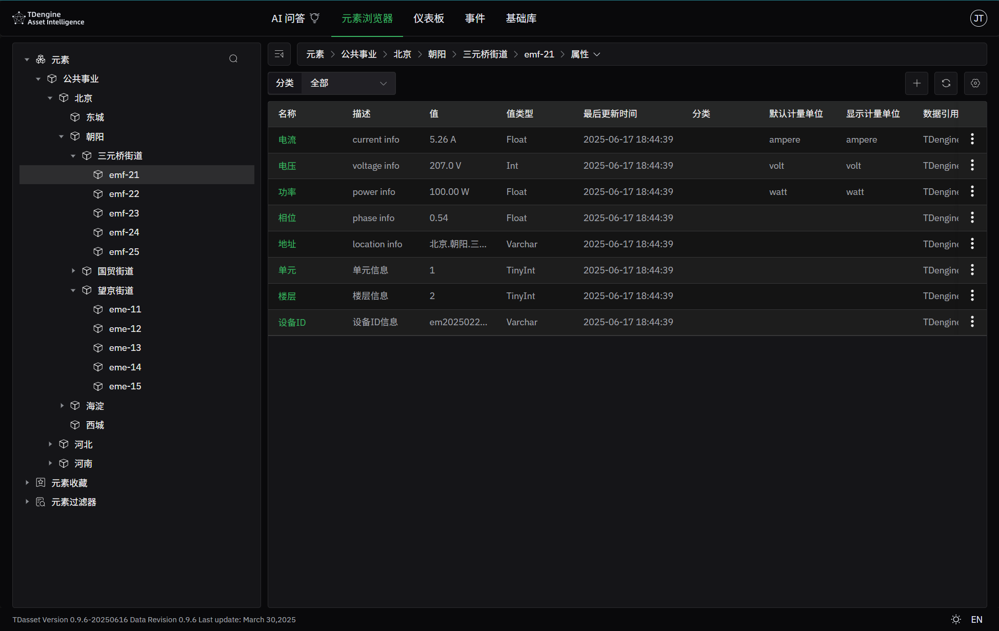
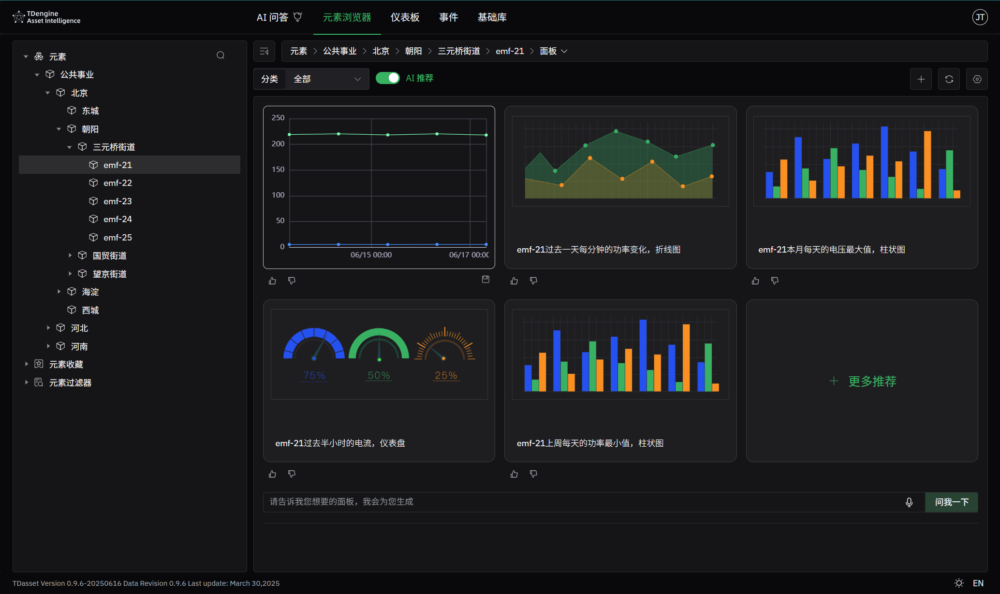
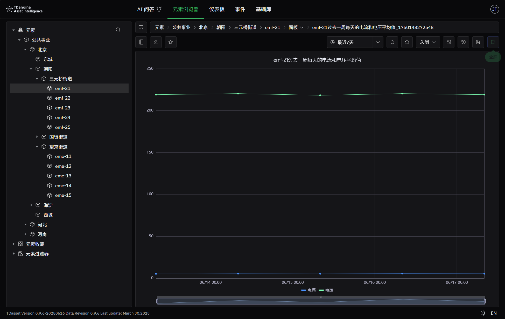

# 快速体验

TDengine Asset Intelligence 充分利用 AI 大模型技术，能基于采集的数据自动感知应用场景，自动生成实时分析、报表与可视化看板，大幅降低了使用门槛，并能帮助用户发掘出诸多新颖的报表与看板，大幅降低了对数据分析师、流程工程师的需求和依赖，缩短了从原始数据到商业洞察、决策之间的距离，提升了数据消费的效率。

本章节将带您体验从下载、安装、启动服务开始，到通过 Web 页面完成配置、分析等操作的完整流程。

:::info
TDengine AI 不仅提供容器化部署、安装包部署，还提供全托管的 TDengine AI Cloud 服务，您只需几步注册即可轻松体验 TDengine AI 提供的数据管理服务，欢迎前往 TDengine AI Cloud 注册页面试用。
:::

## 快速安装

TDengine AI 支持多种安装、部署方式，在不同的操作系统和架构下，都能够体验其强大的功能带来的便利。对操作系统和架构的支持，详见[安装包介绍](./operation/installation/installer)。下面，我们将介绍两种常用的安装部署方式。

### 通过 Docker 容器运行

TDengine AI 提供了 Docker 镜像，用户可以通过 Docker 快速启动 TDengine AI 服务。以下是启动步骤：

1. 克隆 [tdengine-ai-deployment](https://github.com/taosdata/tdengine-ai-deployment) 仓库
   ```bash
   git clone https://github.com/taosdata/tdengine-ai-deployment.git
   ``` 
2. 使用 Docker Compose 启动 TDengine AI
   ```bash
   cd tdengine-ai-deployment/docker
   docker compose up -d
   ```

该命令会自动拉取所需镜像（如本地不存在），并以后台模式启动 **TDengine AI 服务和 TDengine TSDB 服务**。默认情况下，TDengine AI 服务会启动在主机的 6042 端口，可在浏览器输入以下地址访问：[http://localhost:6042](http://localhost:6042) 或 [http://ip:6042](http://ip:6042).
:::tip
如需修改端口，可编辑 `docker-compose.yml` 文件中的 `ports` 配置
:::

### 通过安装包运行

TDengine AI 提供了多平台安装包，以下步骤将以 Linux 系统为例，演示如何下载并安装 TDengine AI。
1. 前往[版本列表](./release-history/version)页面
2. 选择最新版本的 `.tar.gz` 安装包，点击下载链接
3. 解压并执行安装脚本，完成安装（请将 `<version>` 替换为实际版本号）
   ```bash
   tar zxvf tdengine-ai-enterprise-<version>-linux.tar.gz 
   cd tdengine-ai-enterprise-<version>
   ./install.sh
   ```
4. 安装完成后，运行以下命令启动 TDengine AI 服务：
   ```bash
   svc-tdengine-ai start
   ```
至此，TDengine AI 服务已在主机的 6042 端口启动：[http://localhost:6042](http://localhost:6042).

## 快速体验

在 TDengine AI 中，您可以通过 Web 界面快速体验数据导入、元素浏览、AI 面板生成等功能。

:::tip
前置准备

1. 在这个演示中，我们将使用 TDengine TSDB 作为 TDengine AI 的数据源；
1. 如果使用 Docker 容器安装方式运行，则在您的环境中，已启动了一个可用的 TDengine TSDB 服务；
1. 如果使用安装包的方式，则需要安装部署 TDengine TSDB 服务，详见：[使用安装包快速体验 TDengine](https://docs.taosdata.com/get-started/package/).
:::

### 创建连接

1. 在浏览器中输入 [http://localhost:6042](http://localhost:6042), 访问 TDengine AI 服务，默认的用户名、密码为：`jhtao@taosdata.com/123456`;
1. 登录后，会首先进入元素浏览器页面，待数据导入后，在这里可以通过 AI 自动生成数据面板，下一步，让我们先创建一个数据连接；
1. 将鼠标悬停在位于页面右上角的用户头像上方后，会自动弹出下拉菜单，请选择“管理后台”；
1. 打开管理后台页面后，在左侧菜单栏中，选择“连接”，然后点击“+”按钮，添加新连接；
1. 在创建连接页面，请依次填写以下信息：
   - 名称：连接的名称，例如：TDengine
   - 类型：连接的类型，请选择 TDengine
   - 主机：TDengine 服务地址，请输入本机的 IP 地址
   - 端口：TDengine HTTP 服务端口，默认为 `6041`
   - 认证类型：用户名密码
   - 用户名：TDengine 数据库的用户名，默认为 `root`
   - 密码：TDengine 数据库用户的密码，默认为 `taosdata`
1. 填写完成后，请点击“检查”按钮，检查配置是否正确；
1. 检查通过后，即可点击保存。

### 导入示例数据

TDengine AI 提供了以下 7 大场景的示例数据：
- 公共事业：智能电表、智能水表
- 卷烟制丝场景：卷烟厂制丝工艺
- 车辆场景：物流企业车辆管理
- 光伏场景：光伏发电站发电量监测
- 油井场景：油田的油井产量监测
- 污水处理场景：污水处理厂曝气工艺
- 新能源集控场景：新能源集控中心监控

下面，我们选用“公共事业”场景的数据进行演示：
1. 进入“管理后台”页面；
1. 点击左侧菜单栏中的“示例数据”；
2. 选择“公共事业”所在行最右侧的按钮，选择“加载”；
3. 等待状态从 UNLOADED 变为 LOADED 后，即表示数据导入成功。

### 查看导入的元素信息

导入数据后，即可进入“元素”浏览器页面，导入数据的属性：

1. 点击顶部导航栏中的“元素浏览器”；
2. 在左树形结构中的“元素”，即可查看到导入的“公共事业”示例数据的元素信息；
3. 在“公共事业”元素下，共有北京、河北、河南三个地区，其下包含各自的地级市或区；
4. 选择`北京-朝阳-三元桥街道-em-21`这个元素，其代表的是北京市朝阳区三元桥街道标号为 21 的电表 (electricity meter)，查看其通用信息，可以看到这是一个智能电表；查看其属性信息，可以看到电流、电压等物理量属性。


### 体验 AI 生成面板

在 TDengine AI 中，最强大的功能之一是通过 AI 进行数据面板的自动生成：
1. 仍然选择`北京-朝阳-三元桥街道-emf-21`这个元素，会自动跳转到该元素的面板页面，并且会自动开始进行 AI 面板生成。AI 每次会至少推荐 5 个面板，如果对 AI 推荐的面板不满意，也可以在下部对话框中以对话的方式告诉 AI 想要的模板；

1. 在 AI 推荐的面板中，选择第一个推荐面板`em-21过去一周每天的电流和电压平均值，折线图`，点击生成；
1. 等待一段时间，AI 即可生成对应的面板；
1. 选择生成的面板，点击详情，可跳转至面板详情页面，查看更多信息。


## 通过云服务快速体验

TDengine AI 提供了云服务版本，用户可以通过云服务快速体验 TDengine AI 的强大功能，而无需进行本地安装和配置。

## 下一步

至此，我们已经完成基本的 TDengine AI 安装、启动，并通过示例数据体验了元素导入和 AI 自动成功面板功能，您还可以继续进行[仪表板](/docs/feature/dashboard)、[分析](docs/feature/analysis)等功能的体验。
