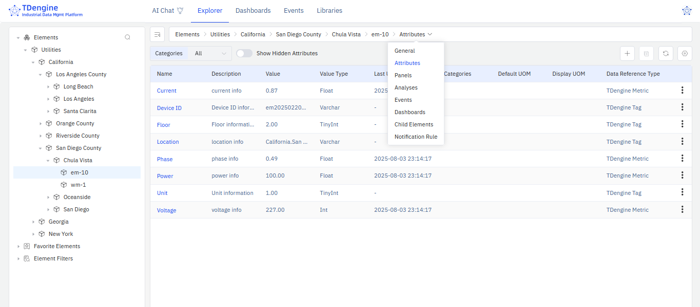
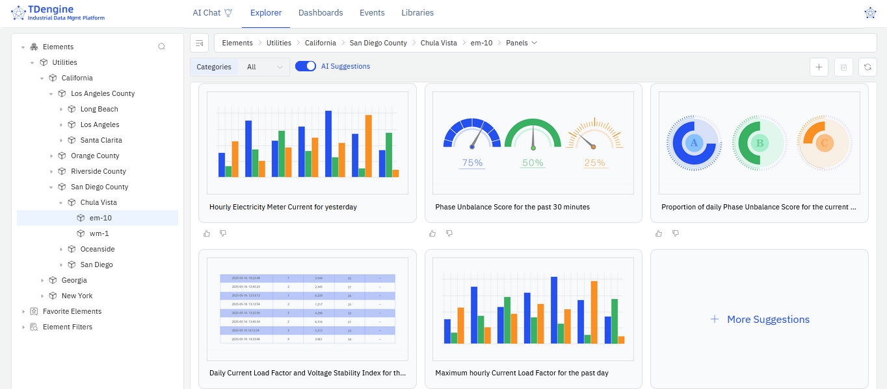
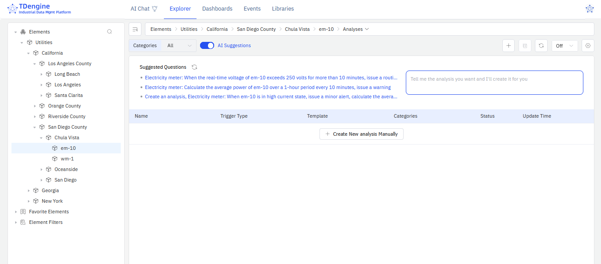

## Load Sample Scenarios

To help you get started quickly, TDengine IDMP comes with built-in sample scenarios. Select at least one sample scenario to continue:

:::important

You must load only one sample scenario at a time. Do not attempt to load a second sample scenario until the previous scenario has finished loading.

:::

- Utilities: A smart meter monitoring system that collects real-time data from electricity and water meters to enable precise energy management and anomaly detection.
- Logistics: A fleet tracking and management system that monitors vehicle location, speed, routes, and overspeed alerts in real time, combining this with mileage analysis to enhance transport safety and operational efficiency.
- Solar Power: A solar power monitoring system that collects real-time data from inverters and environmental sensors to provide a clear view of plant operations and enable intelligent analysis.
- Renewable Energy: A centralized control system for renewable energy that brings together data from wind, solar, and energy storage sources to enable unified monitoring and intelligent dispatch across regional energy sites.
- Wastewater Treatment: A wastewater treatment monitoring system that collects real-time data from bioreactors, membrane tanks, and influent/effluent water quality sensors to visualize the treatment process and enable intelligent control.
- Oil Field: An oilfield production monitoring system that collects real-time data on well output, pressure, and water cut to enable precise, end-to-end management of field operations.

:::tip

The following sections use the data from the Utilities scenario to demonstrate the features of TDengine IDMP. To follow along, select the Utilities scenario and click **Confirm**.

:::

## UI Tour Guide

The Tour Guide opens automatically when you first log in to your TDengine IDMP instance. Click **Next** to move through the guide and see an overview of the TDengine IDMP user interface.

You can click the close (x) button at any time to stop the tour. If you want to go through the tour again, click your profile in the top right and select **Tour Guide**.

## View Element Information

After you have completed the tour, the **Explorer** page is displayed. You can view information about your elements on this page.

1. In the sidebar, click **Elements**. You can see the various elements in the sample scenario displayed in a tree hierarchy.
1. Select **Utilities** > **California** > **San Diego County** > **Chula Vista** > **em-10**. This element represents electricity meter number 10 in Chula Vista, California.
1. From the path bar, select **General** to view the description and other basic information about this electricity meter.
1. Then select **Attributes** to view its attributes, such as current and voltage.

## Try AI-Generated Panels

One of the most powerful features in TDengine IDMP is the ability to automatically generate data panels using AI.

1. Select the element **Utilities** > **California** > **San Diego County** > **Chula Vista** > **em-10**.

1. From the path bar, select **Panels**. Five AI-recommended panels are displayed. You can click **+ More Suggestions** button to generate additional panels.

1. You can also describe the panel you want in natural language using the input box below the recommendations.

   For example, you could enter: "Show a line chart of the voltage and current changes every minute for electricity meter em-10 over the past 24 hours." Then click **Ask AI** to generate the panel you described.

## Try AI-Powered Analysis

TDengine IDMP provides AI analysis to help you detect data changes in real time. When anomalies occur, the system can automatically generate events and trigger alert notifications.

1. Select the element **Utilities** > **California** > **San Diego County** > **Chula Vista** > **em-10**.

1. From the path bar, select **Analyses**. Three AI-recommended questions are displayed.

1. To load one of the AI suggestions, click the link. On the page displayed, you can fine-tune the AI-generated configuration. Click **Save** to complete the setup.

1. You can also describe your analysis in natural language using the input box next to the recommendations.

   For example, you could enter "If power fluctuation for electricity meter em-10 exceeds plus or minus 20% for 30 minutes, generate a 'warning' level alert and calculate the fluctuation range." Then press **Enter** to generate the analysis you described.

## What to Do Next

You’ve explored how to view element data and use AI to automatically generate panels and analyses using the sample dataset. Next, you're encouraged to dive deeper into TDengine IDMP’s capabilities and best practices to make the most of its powerful data management and analytics features.
