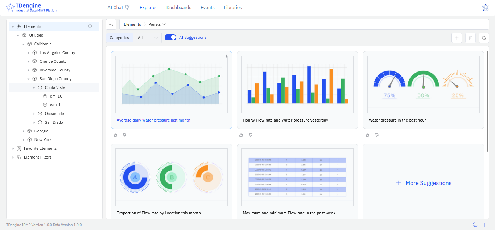

You interact with TDengine IDMP through its web-based GUI. This document describes the layout of the GUI and common operations.

## Main Areas

The TDengine IDMP GUI consists of the following parts:

1. Main Menu: Located at the top of the page and includes **AI Chat**, **Explorer**, **Dashboards**, **Events**, and **Libraries**.
2. Sidebar: Located on the left of the page and displays nodes that can be expanded or collapsed.
3. Path Bar: Located below the main menu and displays the location of the current object. If multiple actions are available, a drop-down menu will appear.
4. Action Bar: Located below the path bar and includes icons for common actions.
5. Main Area: Located below the action bar and displays content that you can view or edit.
6. Info Bar: Located at the bottom of the page and shows the TDengine IDMP and configuration data versions.
7. Profile: Located at the top right of the page and contains a drop-down menu for configuring user and system settings.

For an overview of the GUI, click your profile in the top right and select **Tour Guide**. Click **Next** to move through the guide and see each component of the TDengine IDMP user interface. You can click the close (x) button at any time to stop the tour.

## Buttons and Actions

The IDMP UI supports several common interaction patterns:

1. When you hover over an item in the sidebar, a three-dot icon may appear on the right. Click the icon to open a menu displaying actions you can take on the selected item.
2. The Add (+) button in the main area allows you to add items, such as elements, attributes, or panels.
3. The Select Columns (gear) button at the far right of the action bar lets you customize which columns are displayed in a table.
4. The Paste button on the right side of the action bar lets you paste copied items into the current list.
5. On the left side of the action bar in list views, you may see category or template filters.
6. In the sidebar, there are options for favorites and filter lists. After you perform a search, you can save it as a custom filter.
8. Click the Switch Theme (moon) icon in the lower right to switch between dark and light mode.
