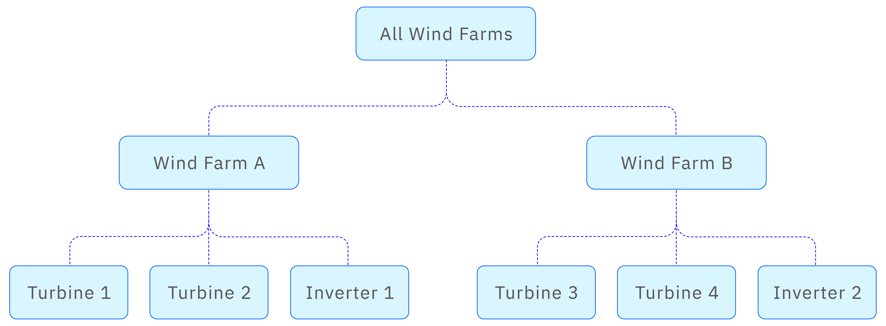
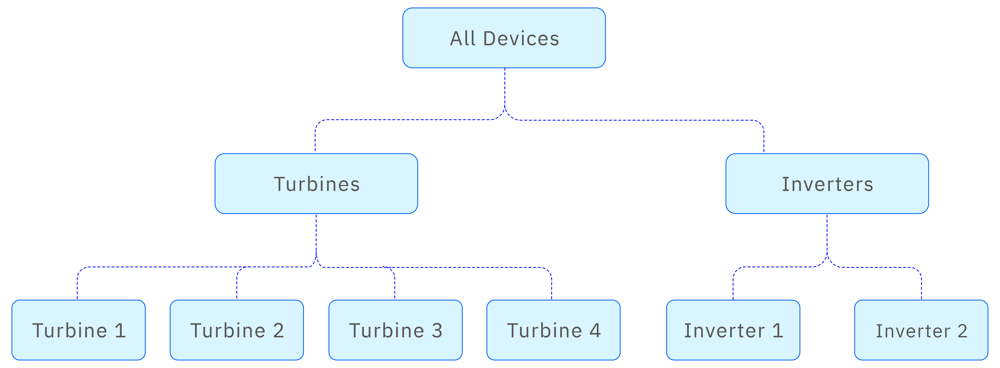
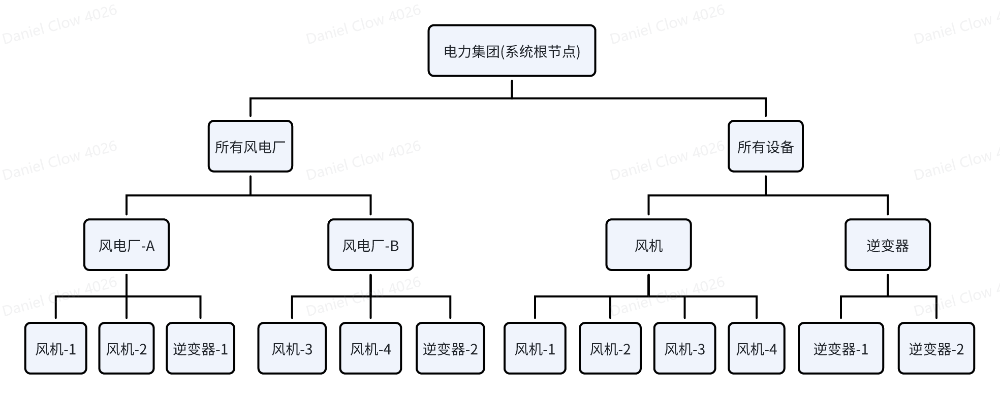

The first step in using IDMP to manage data is to build a data asset model. While the data is stored in a database, the database itself consists of multiple two-dimensional tables, and the relationships between these tables are not directly perceivable. The purpose of data modeling is to help users define and visualize the relationships among these tables, making it easier to manage, locate, and analyze the available data. 

## Data Catalog

Since enterprises typically adopt hierarchical structures for organizational and asset management, IDMP uses a tree-structured hierarchy to manage data assets and build a data catalog. Each node in the tree corresponds to an element, similar to a directory in a computer file system. In addition to holding its own data, a directory (i.e., an element) can contain zero or more subdirectories, which are child elements. An element can represent a specific device, a subsystem of a device, or a logical entity or organization. With this tree-structured data catalog, users can easily browse their owned data assets.

The modeling process involves continuously creating elements and building out the data catalog. The resulting hierarchical structure reflects the actual management structure in the real world. For example, an electric power group may operate multiple wind farms, and each wind farm may contain many wind turbines and inverters. You could start by creating an element called “All Power Plants”, and under that, create elements for each wind farm, such as Wind Farm A, Wind Farm B, etc. Under each wind farm, you can then add multiple wind turbines and inverters, such as Turbine-1, Turbine-2, and so on. In this way, the data model is built level by level, as illustrated in the following diagram:

The example above illustrates a top-down modeling approach. However, when the organizational structure is not yet clear, a bottom-up approach can also be used. For instance, you might start by creating a wind turbine element, configure it fully, and ensure it is operating correctly. Then, you can create a wind farm element and move the turbine element under the wind farm.

Enterprise asset management often involves multiple organizational models, and different roles may require different data perspectives. For example, operations personnel may prefer to organize the tree structure by site or plant, while equipment maintenance teams may prefer to organize it by equipment type. In the case of wind power, you could construct tree structures like the following:

This hierarchical structure naturally aligns with the management needs of enterprises that organize by equipment type and professional specialization.

To ensure management flexibility, IDMP allows multiple tree structures to be built for the same data asset. A device or entity can belong to multiple hierarchies through element referencing, making it easier to manage from different perspectives. In the case of wind power, you could construct tree structures like the following:

This design provides flexible ways to view data based on user roles:

Plant managers can quickly locate assets within their jurisdiction using the geographical tree structure.
Specialized maintenance teams can manage similar types of equipment centrally using the equipment-type tree structure.

Since an element can belong to multiple tree structures, IDMP uses an element referencing mechanism to reduce data redundancy and ensure consistency. There are three types of references: strong reference, weak reference, and containment reference, which will be introduced in detail in later chapters. For first-time users of IDMP, the strong reference is the simplest option when copying an element from one tree structure to another.

By supporting the creation of multiple parallel hierarchical trees, IDMP perfectly adapts to the diverse management needs and organizational structures of enterprises.

## Elements

In the tree structure, select an element and click the three-dot menu on the right to open a dropdown menu. Then choose “Create Sub-Element” to create a child element under the current one. At this point, you can choose whether to use an element template and specify the reference type (default is strong). The different types of element references will be covered in a later advanced section—for now, simply use the default strong reference to complete the creation of a new element.

You can configure the element’s name, category, location, description, and more.

For the same type of equipment, it’s recommended to first create an element template in the Knowledge Base. This allows for batch creation and management of elements while ensuring data standardization. 

IDMP also provides copy and paste functionality for elements, making it easy to create similar types of elements efficiently.

Once an element is created, it can be deleted or modified. In the tree view, you can also drag and drop an element to another node, which creates an element reference. These operations—including modify, delete, copy, paste, and move—are designed to help you flexibly build and adjust the tree structure.

## Attributes

An element can have many dynamic or static attributes. On top of the tree structure, only when each element’s attributes are properly configured can the physical world be truly mapped to the digital world, forming its digital twin.

To configure attributes, select an element in the tree structure. The breadcrumb bar will update to reflect the current location. In the dropdown at the end of the breadcrumb, choose “Attributes”, or click the three-dot menu next to the element in the tree and select “Attributes” from the dropdown. The system will then display the list of attributes for that element.

Click the “+” icon at the top right of the attribute list to create a new attribute.

Attributes can be configured with a name, category, data type, description, and more. For numeric types, you can also set limit values and time-series forecasting options, and add custom properties. Attributes can also be set as constants, hidden, or excluded as needed.

But most importantly, attributes can be configured with a Data Reference. A data reference means that the attribute’s value is derived from a specific data source. The reference can point to a TDengine metric or TDengine tag, indicating that the attribute actually maps to a specific column or tag value in a table within TDengine TSDB. Essentially, a reference is a mapping—it does not copy the data, but rather retrieves it from the data source (e.g., TDengine TSDB) at access time.

In the next version, data references will also support formulas and string builders, making them even more flexible to support data standardization. A formula means the attribute is calculated based on the values of other attributes—for example, the "power" attribute of a smart meter can be calculated by multiplying the "current" and "voltage" attributes. You only need to configure the expression. A string builder defines a rule for constructing a new string based on several existing strings.

In the future, data references will not only support TDengine TSDB, but also other time-series databases and relational databases.

Attributes can also be deleted, modified, copied, and pasted as needed.
