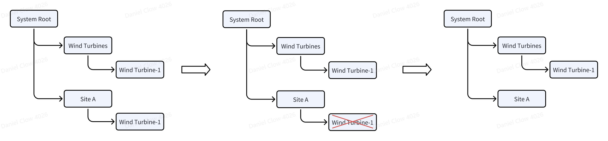
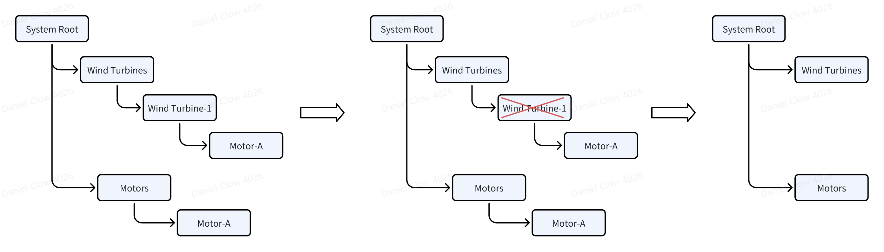
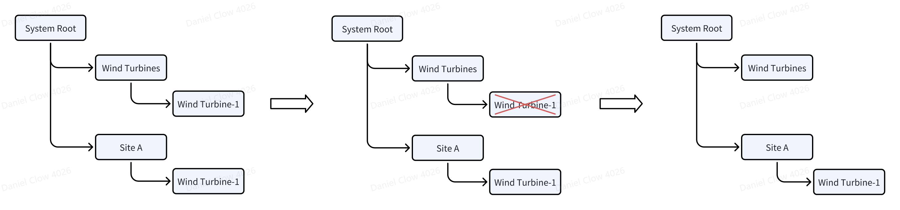
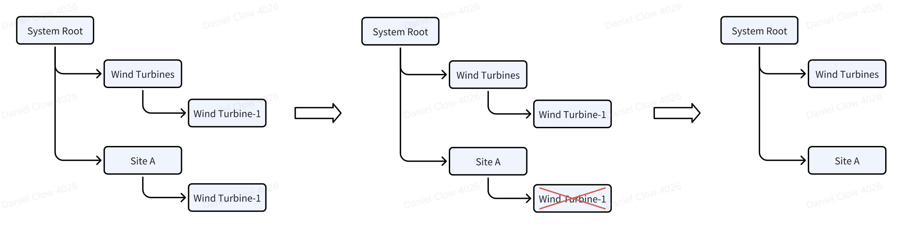

A single data asset often needs to be viewed from different angles depending on the organizational structure or user roles. To support this, IDMP allows an element to be added as a child under another element via a reference — this is called an Element Reference. That means an element can have multiple parents and be referenced in multiple places. These are not physical copies, but logical links — similar to how symbolic links work in a file system.  

When you create a new element in a tree structure, that first instance is automatically counted as a reference. So every element has at least one reference. If there's only one, we usually just call it the element itself, not a reference.

You can delete an element directly, or it might be removed indirectly if one of its parents is deleted. But since an element might be referenced elsewhere, deleting it in one place doesn’t always mean it’s gone. Only when the total number of references drops to zero is the element truly deleted. To make things clearer, IDMP defines three types of references: strong reference, containment reference, and weak reference.

## Strong Reference

The most common type of reference is the Strong Reference (also known as Parent-Child in PI System terminology). When you create an element, the default reference type is strong. As long as the number of strong references to an element is greater than zero, the element will not be truly deleted—it will continue to appear in at least one tree structure. See the diagram below:

Wind Turbine-1 has strong references to both Wind Turbines and Site A. When Wind Turbine-1 is deleted from under Site A, it is not actually removed from the system—it still exists under the Wind Turbines element.

## Containment Reference

When one element is part of another—for example, a motor on a wind turbine—the relationship between the wind turbine element and the motor is a containment reference. This type of reference indicates that the element belongs to a parent in a compositional way. It is a stronger relationship than a strong reference. When creating a new sub-element under a parent, you can choose to use a containment reference. If a parent element with a containment reference is deleted, the contained element will also be permanently deleted, even if it has other references elsewhere. This means the element will be removed from all tree structures. See the diagram below:

The element Motor-A has two parent elements, one of which—Wind Turbine-1—is linked to it via a containment reference. When Wind Turbine-1 is deleted, Motor-A is also removed from all locations, regardless of its other references.

## Weak Reference

When you want to establish a parent-child hierarchy between two elements without affecting the child element's lifecycle, you can use a weak reference. For example, if Wind Turbine-1 is weakly referenced under Wind Turbines, but strongly referenced under Site A, deleting Wind Turbine-1 from Wind Turbines has no impact—the instance under Site A remains unaffected.

However, if you delete Wind Turbine-1 from under Site A, then the instance under Wind Turbines will also be removed. This is because Wind Turbine-1 no longer has any strong or composition references, and all weak references must also be removed when that happens.

## Reference Rules

To summarize, here are the rules for element references:

1. When creating an element, the relationship with its parent can be set as either a strong or composition reference.
1. An element can have zero or more weak references, which can be deleted freely without affecting the existence of other references or the element itself.
1. An element can have at most one composition reference.
1. If an element does not have a composition reference, then it must have at least one strong reference.
1. If the parent element of a composition reference is deleted, all references to that element must also be removed, and the element is permanently deleted.
1. When a reference is deleted and the element has no remaining strong or composition references, then all weak references must also be deleted, and the element is permanently removed.

When an element or its reference is deleted from a tree structure, its child elements or references must also be removed. However, whether the element and its children continue to exist depends on the reference rules outlined above.

In IDMP's design, each tree structure represents a specific analytical dimension. To reduce implementation complexity, a single element cannot be referenced multiple times within the same tree structure via different paths. An element can appear in multiple tree structures, but within any one structure, it can appear only once. In future versions of IDMP, support will be added to allow the same element to be referenced multiple times within a single tree structure.
