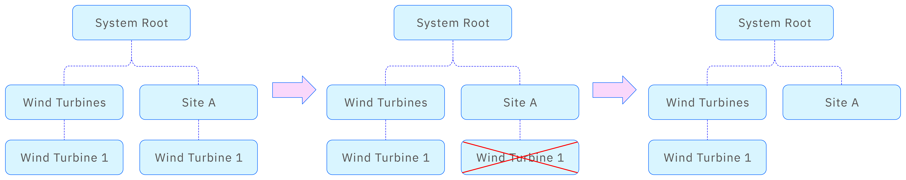
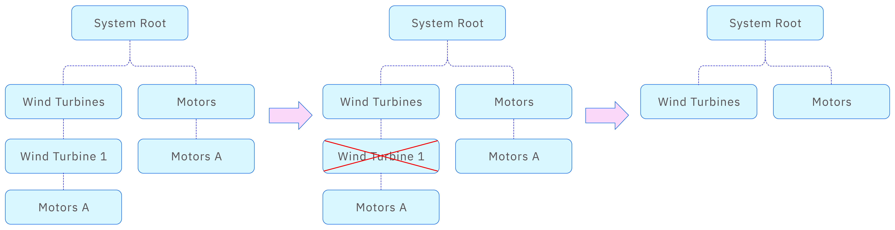
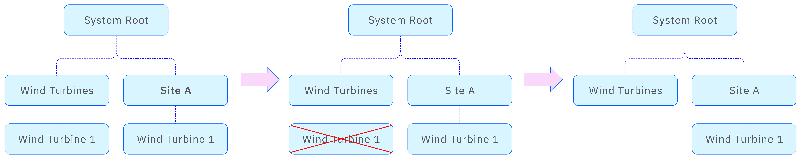

A single data asset often needs to be viewed from different angles depending on the organizational structure or user roles. To support this, TDengine IDMP allows an element to be added as a child under another element via a reference. This is called an element reference. With element references, elements can have multiple parents and be referenced in multiple places. These are not physical copies, but logical links, similar to how symbolic links work in a file system.  

An element may be removed if you delete it or if one of its parents is deleted. But because the element might be referenced elsewhere, removing it from one place does not necessarily mean that the element no longer exists in the system. The element is only deleted once its total number of references drops to zero.

TDengine IDMP defines three types of references: strong, composition, and weak.

## Strong Reference

The most common type of reference is the strong reference (also known as Parent-Child in PI System terminology). When you create an element, the default reference type is strong. As long as the number of strong references to an element is greater than zero, the element will not be deleted but will continue to appear in at least one tree structure.

In the figure, **Wind Turbine 1** has strong references to **Wind Turbines** and to **Site A**. When **Wind Turbine 1** is deleted from **Site A**, it is not removed from the system because it still exists under the **Wind Turbines** element.

## Composition Reference

When one element is part of another — for example, a motor on a wind turbine — the relationship between the wind turbine element and the motor is a composition reference. This type of reference indicates that the element belongs to a parent in a compositional way. It is a stronger relationship than a strong reference.

If an element is deleted, any child elements with a composition reference to that element are also deleted, even if they contain other references. They are removed from all tree structures.

In the figure, **Motor A** has two parent elements, and it is linked to **Wind Turbine 1** with a composition reference. After **Wind Turbine 1** is deleted, **Motor A** is also removed from **Motors** and all other locations, regardless of its other references.

## Weak Reference

If you want to establish a parent-child hierarchy between two elements without affecting the lifecycle of the child element, you can use a weak reference. In the figure, **Wind Turbine 1** is weakly referenced to **Wind Turbines** and strongly referenced to **Site A** only. Removing **Wind Turbine 1** from **Wind Turbines** has no impact on **Site A** because the strong reference remains.

However, if you remove **Wind Turbine 1** from **Site A**, the instance under **Wind Turbines** is also removed. This is because **Wind Turbine 1** no longer has any strong or composition references. If an element has  only weak references, it is deleted.

## Reference Rules

The rules for element references are described as follows:

1. When creating an element, you can set the relationship with its parent as a strong or composition reference. An element must have at least one strong or composition reference.
2. An element can have zero or more weak references, which can be deleted freely without affecting the existence of other references or the element itself.
3. An element can have at most one composition reference.
5. If the parent element of a composition reference is deleted, all references to that element are also removed, and the element is permanently deleted.
6. When a reference is removed and the element has no remaining strong or composition references, then all weak references are also removed, and the element is permanently deleted.

When an element or its reference is deleted from a tree structure, its child elements or references are also removed. However, whether the element and its children continue to exist depends on the reference rules outlined above.

In TDengine IDMP, each tree hierarchy represents a specific analytical dimension. A single element cannot be referenced multiple times within the same tree structure via different paths. An element can appear in multiple tree structures, but within any one structure, it can appear only once.
